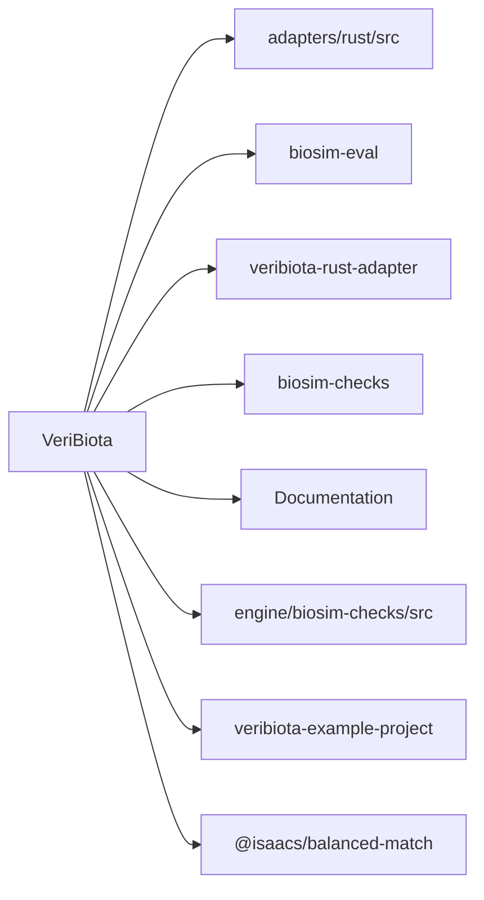
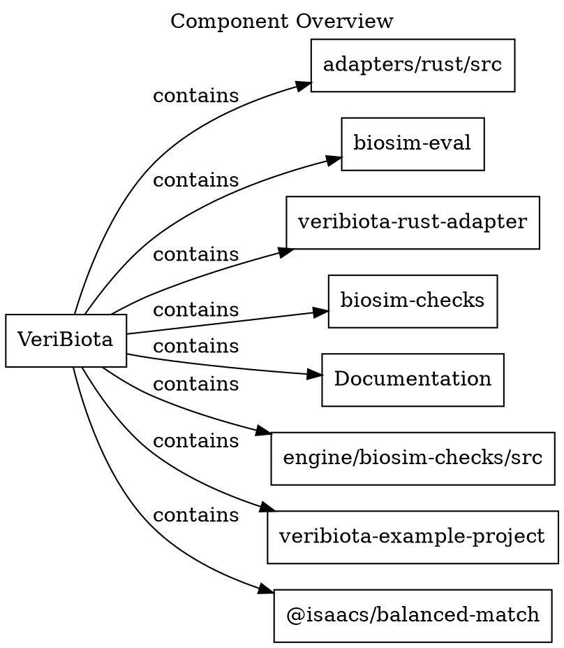
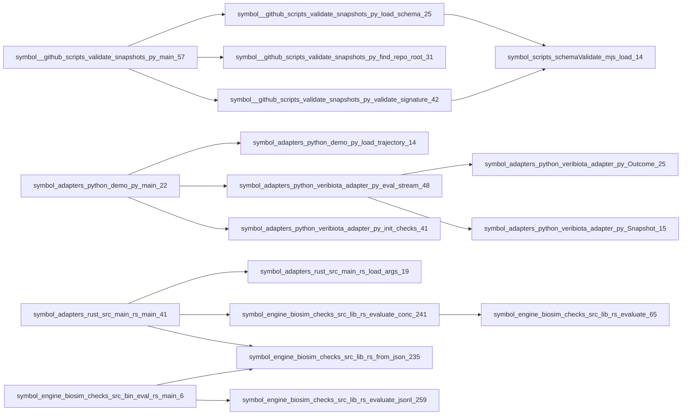
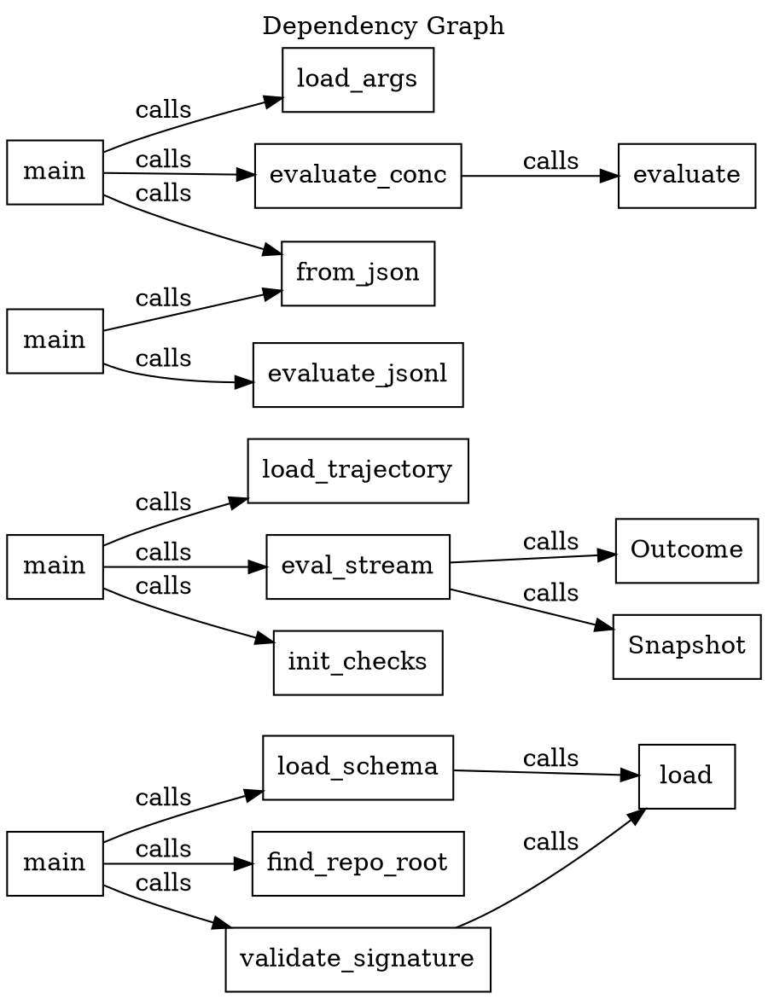
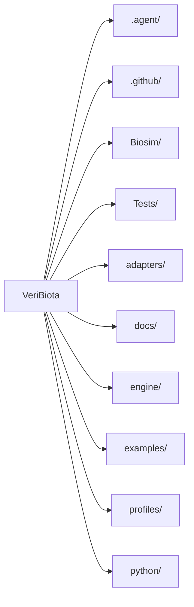
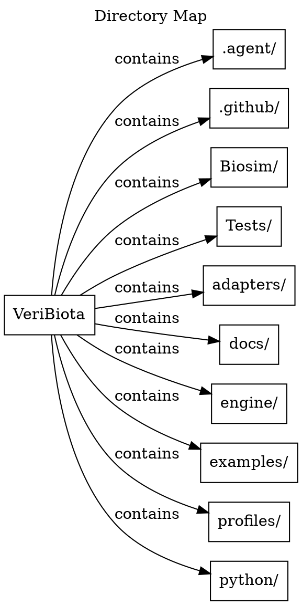
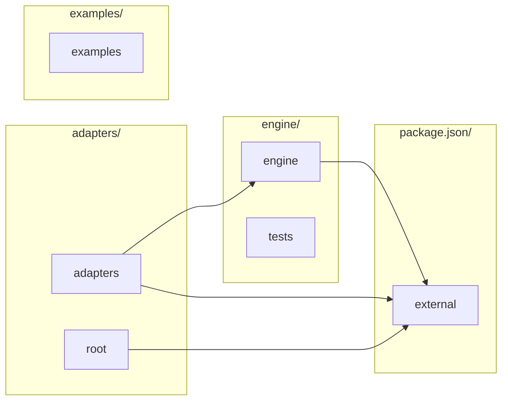
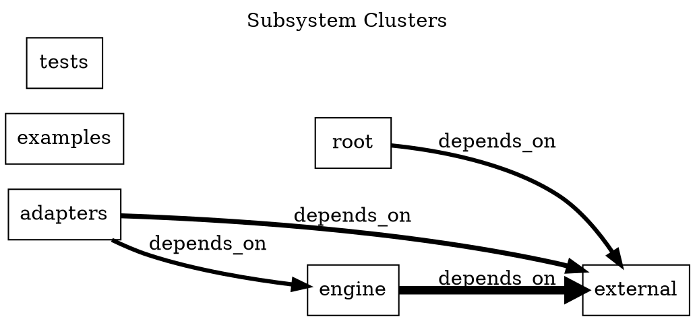

<details>
<summary>Build metadata</summary>

```json
{
  "freshnessKey": "9254efc25b56fc87e1d6933467d910d941fe804a",
  "plannerReason": "Generated to provide a compact architecture and dependency overview.",
  "changedPaths": [],
  "dependencyPaths": [],
  "dependencyEvidenceIds": [],
  "evidenceIds": [],
  "qualityWarnings": []
}

```
</details>

# Diagrams

Generated 4 diagrams.

## Diagram Navigation

- [Component Overview](#component-overview) (component-overview; 9 nodes; 8 edges; omitted 28 nodes / 28 edges)
- [Dependency Graph](#dependency-graph) (dependency-graph; 18 nodes; 16 edges; omitted 0 nodes / 324 edges)
- [Directory Map](#directory-map) (directory-map; 11 nodes; 10 edges; omitted 7 nodes / 7 edges)
- [Subsystem Clusters](#subsystem-clusters) (component-overview; 6 nodes; 4 edges; omitted 0 nodes / 235 edges)

## Related Pages

- [architecture](architecture.md)
- [dependencies](dependencies.md)

## Component Overview

Shows the most prominent inferred components connected to the repository root.

Explained in:
- [Architecture Summary](architecture.md#architecture-summary)
- [Graph Hotspots](architecture.md#architecture-hotspots)
- [Design-Shaping Dependencies](dependencies.md#design-shaping-dependencies)

Interpretation note:
- Interpretation: use this view to see the main repository-owned components and their highest-level relationships before drilling into page-level details. Favor it when you need a fast inventory of the system surface.

Rendered surface:
- rendered nodes: 9, rendered edges: 8

Node mix:
- component: 8, repository: 1

Omitted surface:
- omitted nodes: 28
- omitted edges: 28





Structured graph:
- nodes: 9
- edges: 8

Layout:
- direction: LR
- strategy: root-spoke

Simplification:
- simplified: yes
- rendered nodes: 9
- rendered edges: 8
- omitted nodes: 28
- omitted edges: 28
- Omitted 28 lower-priority components to keep the overview readable.
- Switched to a left-to-right root-spoke layout to keep the largest components scannable.

Why these edges:
- Repository contains VeriBiota as a prominent component.
- Repository contains VeriBiota as a prominent component.
- Repository contains VeriBiota as a prominent component.
- Repository contains VeriBiota as a prominent component.
- Repository contains VeriBiota as a prominent component.
- Repository contains VeriBiota as a prominent component.

<details>
<summary>Citations:</summary>

- `adapters/README.md`
- `docs/architecture.md`
- `docs/assets/favicon.svg`
- `docs/assets/logo-wordmark.svg`
- `docs/assets/logo.svg`
- `docs/ATTESTED_PROFILES.md`
- `docs/canonicalization.md`
- `docs/CI_ADOPTION_KIT.md`
- `docs/cli.md`
- `docs/code_scanning.md`
- `adapters/rust/src/main.rs`
- `engine/biosim-checks/src/bin/eval.rs`
</details>

## Dependency Graph

Shows a sampled set of dependency and call relationships across indexed entities.

Explained in:
- [Graph Hotspots](architecture.md#architecture-hotspots)
- [Design-Shaping Dependencies](dependencies.md#design-shaping-dependencies)
- [Navigation Guidance](dependencies.md#dependency-guidance)

Interpretation note:
- Interpretation: use this graph to spot concentrated dependency hubs and outward package pressure across the repository. Favor it when you need to reason about coupling, likely blast radius, or external dependency concentration.

Rendered surface:
- rendered nodes: 18, rendered edges: 16

Node mix:
- symbol: 18

Omitted surface:
- omitted nodes: 0
- omitted edges: 324





Structured graph:
- nodes: 18
- edges: 16

Layout:
- direction: LR
- strategy: edge-ranked

Simplification:
- simplified: yes
- rendered nodes: 18
- rendered edges: 16
- omitted nodes: 0
- omitted edges: 324
- Omitted 324 lower-priority dependency edges to avoid an unreadable graph.
- Kept a rank-ordered sample of stronger edges and switched to a left-to-right layout for denser graphs.

Why these edges:
- symbol:.github/scripts/validate_snapshots.py:load_schema:25 calls symbol:scripts/schemaValidate.mjs:load:14 via .github/scripts/validate_snapshots.py.
- symbol:.github/scripts/validate_snapshots.py:main:57 calls symbol:.github/scripts/validate_snapshots.py:find_repo_root:31 via .github/scripts/validate_snapshots.py.
- symbol:.github/scripts/validate_snapshots.py:main:57 calls symbol:.github/scripts/validate_snapshots.py:load_schema:25 via .github/scripts/validate_snapshots.py.
- symbol:.github/scripts/validate_snapshots.py:main:57 calls symbol:.github/scripts/validate_snapshots.py:validate_signature:42 via .github/scripts/validate_snapshots.py.
- symbol:.github/scripts/validate_snapshots.py:validate_signature:42 calls symbol:scripts/schemaValidate.mjs:load:14 via .github/scripts/validate_snapshots.py.
- symbol:adapters/python/demo.py:main:22 calls symbol:adapters/python/demo.py:load_trajectory:14 via adapters/python/demo.py.
- symbol:adapters/python/demo.py:main:22 calls symbol:adapters/python/veribiota_adapter.py:eval_stream:48 via adapters/python/demo.py.
- symbol:adapters/python/demo.py:main:22 calls symbol:adapters/python/veribiota_adapter.py:init_checks:41 via adapters/python/demo.py.
- symbol:adapters/python/veribiota_adapter.py:eval_stream:48 calls symbol:adapters/python/veribiota_adapter.py:Outcome:25 via adapters/python/veribiota_adapter.py.
- symbol:adapters/python/veribiota_adapter.py:eval_stream:48 calls symbol:adapters/python/veribiota_adapter.py:Snapshot:15 via adapters/python/veribiota_adapter.py.

<details>
<summary>Citations:</summary>

- `adapters/README.md`
- `docs/architecture.md`
- `docs/assets/favicon.svg`
- `docs/assets/logo-wordmark.svg`
- `docs/assets/logo.svg`
- `docs/ATTESTED_PROFILES.md`
- `docs/canonicalization.md`
- `docs/CI_ADOPTION_KIT.md`
- `docs/cli.md`
- `docs/code_scanning.md`
- `adapters/rust/src/main.rs`
- `engine/biosim-checks/src/bin/eval.rs`
</details>

## Directory Map

Shows top-level directory layout to orient unfamiliar agents.

Interpretation note:
- Interpretation: use this map to orient yourself in the repository layout before reading code. Favor it when you need to connect top-level paths to the graph surfaces shown elsewhere.

Rendered surface:
- rendered nodes: 11, rendered edges: 10

Node mix:
- directory: 10, repository: 1

Omitted surface:
- omitted nodes: 7
- omitted edges: 7





Structured graph:
- nodes: 11
- edges: 10

Layout:
- direction: LR
- strategy: linear-map

Simplification:
- simplified: yes
- rendered nodes: 11
- rendered edges: 10
- omitted nodes: 7
- omitted edges: 7
- Omitted 7 additional top-level directories from the diagram.
- Switched to a left-to-right directory map to keep the remaining top-level layout readable.

Why these edges:
- .agent/ is a top-level directory under the repository root.
- .github/ is a top-level directory under the repository root.
- Biosim/ is a top-level directory under the repository root.
- Tests/ is a top-level directory under the repository root.
- adapters/ is a top-level directory under the repository root.
- docs/ is a top-level directory under the repository root.
- engine/ is a top-level directory under the repository root.
- examples/ is a top-level directory under the repository root.
- profiles/ is a top-level directory under the repository root.
- python/ is a top-level directory under the repository root.

<details>
<summary>Citations:</summary>

- `adapters/README.md`
- `docs/architecture.md`
- `docs/assets/favicon.svg`
- `docs/assets/logo-wordmark.svg`
- `docs/assets/logo.svg`
- `docs/ATTESTED_PROFILES.md`
- `docs/canonicalization.md`
- `docs/CI_ADOPTION_KIT.md`
- `docs/cli.md`
- `docs/code_scanning.md`
- `adapters/rust/src/main.rs`
- `engine/biosim-checks/src/bin/eval.rs`
</details>

## Subsystem Clusters

Shows a simplified subsystem graph grouped by dominant repository paths and graph-connected merges.

Explained in:
- [Subsystem Clusters](architecture.md#architecture-subsystems)
- [Architecture Summary](architecture.md#architecture-summary)

Interpretation note:
- Interpretation: use this clustering view to understand which source areas act like larger architectural slices and how strongly they connect. Favor it when you need a quick map of architectural boundaries instead of individual files or packages.

Rendered surface:
- rendered nodes: 6, rendered edges: 4

Node mix:
- subsystem: 6

Omitted surface:
- omitted nodes: 0
- omitted edges: 235





Structured graph:
- nodes: 6
- edges: 4

Layout:
- direction: LR
- strategy: hierarchy-banded

Simplification:
- simplified: yes
- rendered nodes: 6
- rendered edges: 4
- omitted nodes: 0
- omitted edges: 235
- Collapsed 235 additional subsystem edges from the rendered view.
- Grouped subsystem nodes by dominant path segment across 4 hierarchy buckets before rendering edges.
- Added band-order guide links so large hierarchy groups stay visually ordered before cross-subsystem edges are rendered.
- Used a left-to-right hierarchy-banded layout so dominant path groups stay ordered and visually clustered.
- Subsystem graph edges are condensed by repeated source/target pairs before sampling.

Why these edges:
- adapters calls engine via adapters/rust/src/main.rs. 3 additional inferred edges reinforce this path. (4 inferred edges combined.)
- adapters depends_on external via adapters/rust/Cargo.toml. 4 additional inferred edges reinforce this path. (5 inferred edges combined.)
- engine depends_on external via engine/biosim-checks/Cargo.toml. 18 additional inferred edges reinforce this path. (19 inferred edges combined.)
- root depends_on external via package.json. 3 additional inferred edges reinforce this path. (4 inferred edges combined.)

<details>
<summary>Citations:</summary>

- `adapters/README.md`
- `docs/architecture.md`
- `docs/assets/favicon.svg`
- `docs/assets/logo-wordmark.svg`
- `docs/assets/logo.svg`
- `docs/ATTESTED_PROFILES.md`
- `docs/canonicalization.md`
- `docs/CI_ADOPTION_KIT.md`
- `docs/cli.md`
- `docs/code_scanning.md`
- `adapters/rust/src/main.rs`
- `engine/biosim-checks/src/bin/eval.rs`
</details>

## Citations

<details>
<summary>Citations:</summary>

- `adapters/README.md`
- `docs/architecture.md`
- `docs/assets/favicon.svg`
- `docs/assets/logo-wordmark.svg`
- `docs/assets/logo.svg`
- `docs/ATTESTED_PROFILES.md`
- `docs/canonicalization.md`
- `docs/CI_ADOPTION_KIT.md`
- `docs/cli.md`
- `docs/code_scanning.md`
- `adapters/rust/src/main.rs`
- `engine/biosim-checks/src/bin/eval.rs`
</details>
